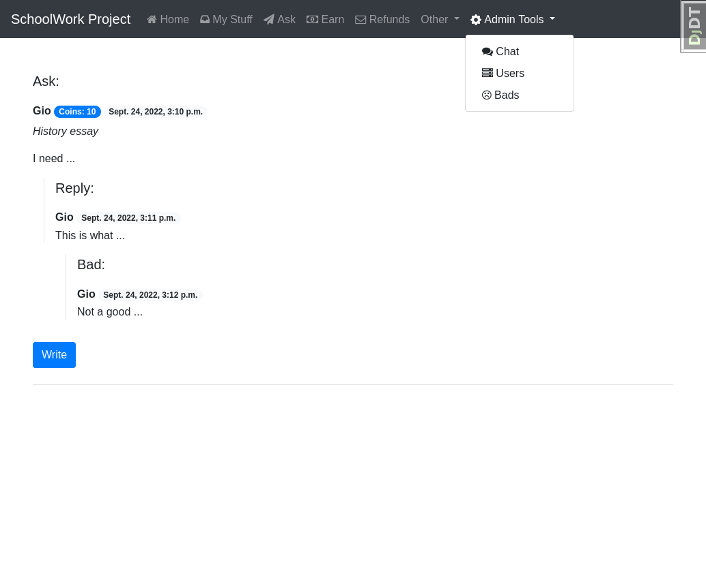
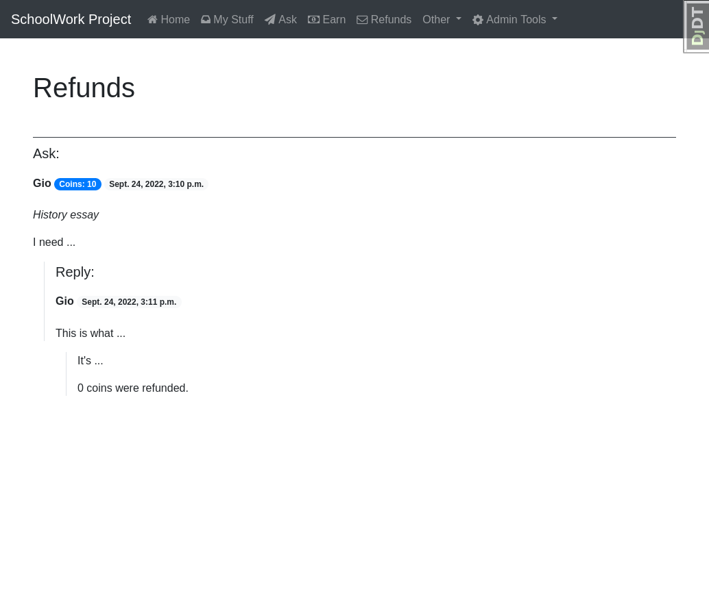

# schoolwork-project
Schoolwork Project is a web application that allows users to ask and answer questions, exchange notes, create maps, or write articles using a virtual currency.

As my first Django project, this was a learning experience. I created it with Valerio Cirami, a close friend of mine. It contains a wide range of features such as user management, refund systems, internal chats to communicate with the staff, and a custom admin menu. Even though it is not ready for deployment and still needs many corrections, I have gained a lot of knowledge about the framework.

Some screenshots are below:

About

Ask

Bad

Chat

earn

Footer

Home 

inbox

index

Login

Refunds
